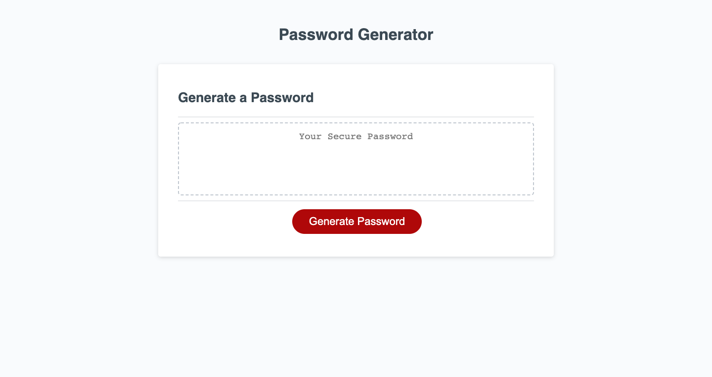

# 03 JavaScript: Password Generator

## Random Password Generator
This application serves employees so they are able to generate random passwords based on
chosen criteria. This app runs in the browser and features dynamically updated HTML & CSS
powered by JavaScript. It is easy to use, with a clean and clear user interface that is
responsive and adapts to multiple screen sizes.

The password CAN include special characters. If you're unfamiliar with special characters,
please see this [list of special characters](https://www.owasp.org/index.php/Password_special_characters) sponsored by the OWASP Foundation.

## User Story

```
AS AN employee with access to sensitive data
I WANT to randomly generate a password that meets certain criteria
SO THAT I can create a strong password that provides greater security
```

## Acceptance Criteria

```
GIVEN I need a new, secure password
WHEN I click the button to generate a password
THEN I am presented with a series of prompts for password criteria
WHEN prompted for password criteria
THEN I select which criteria to include in the password
WHEN prompted for the length of the password
THEN I choose a length of at least 8 characters and no more than 128 characters
WHEN asked for character types to include in the password
THEN I confirm whether or not to include lowercase, uppercase, numeric, and/or special characters
WHEN I answer each prompt
THEN my input should be validated and at least one character type should be selected
WHEN all prompts are answered
THEN a password is generated that matches the selected criteria
WHEN the password is generated
THEN the password is either displayed in an alert or written to the page
```

## Mock-Up


## Password Generator Link
[PASSWORDGENERATOR]